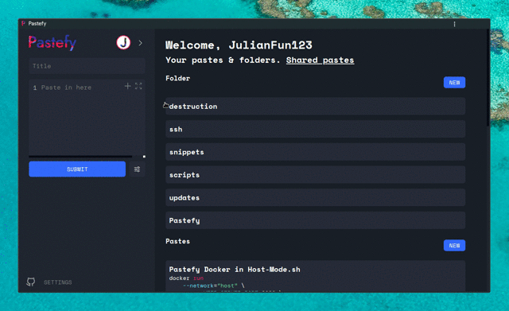
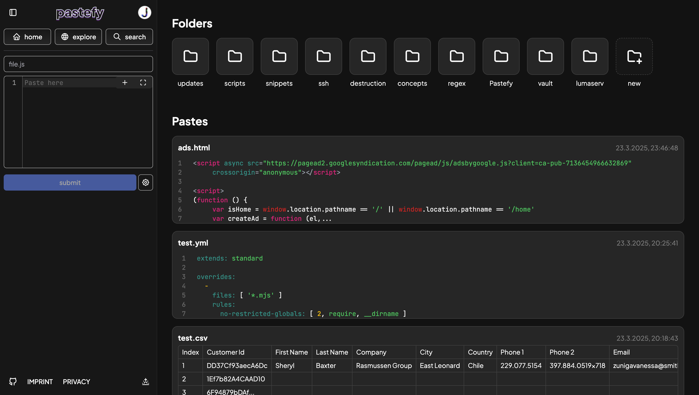
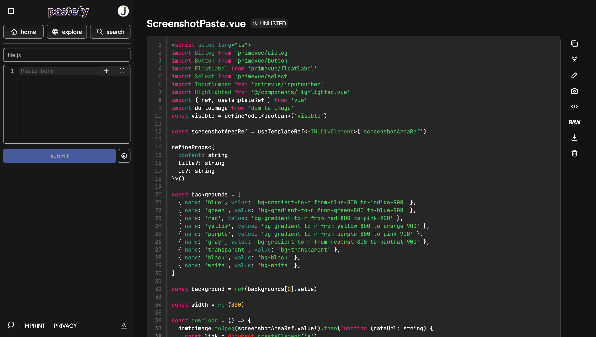
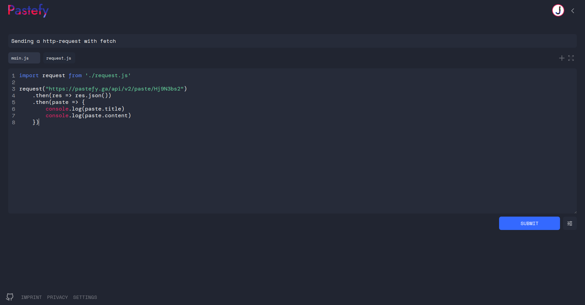
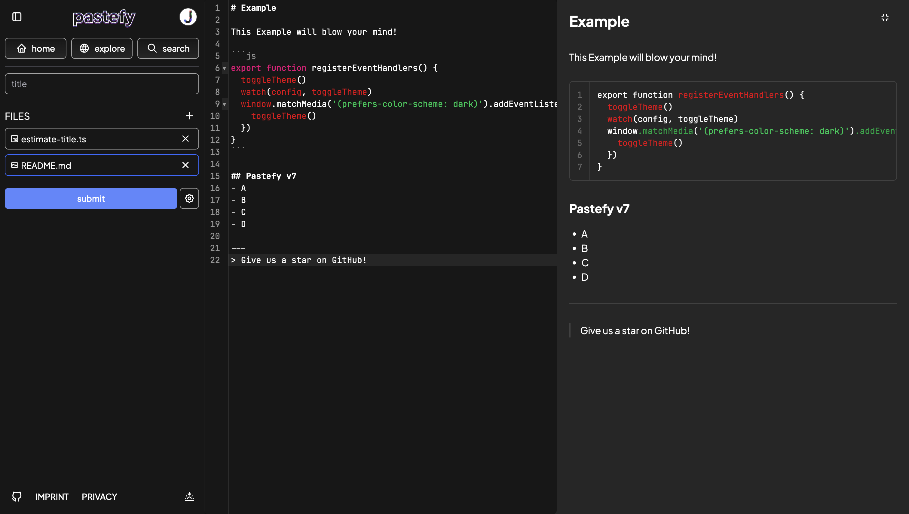

<p align="center"></p>

Pastefy is an open source alternative to Gists or Pastebin.<br>
You want to share some code to your friends or just save it for yourself? Just paste it.



## Features
- Raw-Preview
- Copy Button
- Fork
- An API ([Docs](https://github.com/interaapps/pastefy/wiki/API-v2))
- Log in
  - Folders 
  - See your created pastes
  - delete created pastes
- Create paste with `curl -F f=@file.txt pastefy.ga`

# Overview
- [Screenshots](#Screenshots)
- [Deploy](#Deploy)
  - [Docker](#Deploy)
  - [Docker-Compose](#Docker-Compose)
  - [Custom Docker-Compose (Using Docker-Hub)](#custom-docker-compose-using-docker-hub)
  - [Kubernetes](#Kubernetes)
  - [Container-Less](#Container-Less)
- [Configuration](#Configuration)
- [Develop](#Develop)
- [API](#API)

# Screenshots





## Deploy
### Docker
DockerHub: https://hub.docker.com/r/interaapps/pastefy
```bash
docker run -p 8080:80 \
      --env HTTP_SERVER_PORT=80 \
      --env HTTP_SERVER_CORS="*" \
      --env DATABASE_DRIVER=mysql \
      --env DATABASE_NAME=pastefy \
      --env DATABASE_USER=pastefy \
      --env DATABASE_PASSWORD=pastefy \
      --env DATABASE_HOST=host \
      --env DATABASE_PORT=3306 \
      --env AUTH_PROVIDER=NONE \
      --env SERVER_NAME=http://example.com \
      --env OAUTH2_PROVIDER_CLIENT_ID=NONE \
      --env OAUTH2_PROVIDER_CLIENT_SECRET= \
      interaapps/pastefy
```
Or [Pastefy Docker in Host-Mode](https://pastefy.ga/JWLoudTI)

### Docker-Compose
https://github.com/interaapps/pastefy/blob/master/docker-compose.yml
```bash
git clone https://github.com/interaapps/pastefy.git
cd pastefy
docker-compose up
```

### Custom Docker-Compose (Using Docker-Hub)
https://pastefy.ga/Hj9N3bs2
```bash
wget https://pastefy.ga/Hj9N3bs2/raw -O docker-compose.yml
nano docker-compose.yml
docker-compose up
```

### Kubernetes
You can find an example kubernetes file here https://github.com/interaapps/pastefy/blob/master/deployment/prod.yaml. It's made to use with gitlab CI and cert-manager. With some changes you can use it.

### Container-Less
```bash
git clone https://github.com/interaapps/pastefy.git
cd pastefy/frontend
npm run install
npm run build
cd ../backend
mvn clean package
cd ..
cp .env.example .env
nano .env
java -jar backend/target/backend.jar
```
Using intelliJ? Look at [Develop](#Develop)

## Configuration
### Basic Stuff 
```properties
http.server.port=1337
HTTP_SERVER_CORS=*

DATABASE_DRIVER=mysql
DATABASE_NAME=
DATABASE_USER=
DATABASE_PASSWORD=
DATABASE_HOST=
DATABASE_PORT=3306

SERVER_NAME=http://example.com


# Optional
PASTEFY_INFO_CUSTOM_LOGO=https://urltoimage
PASTEFY_INFO_CUSTOM_NAME=Custom Name
PASTEFY_INFO_CUSTOM_FOOTER=WEBSITE=https://example.org,SEPERATED BY COMMA=https://example.org

# Requires login for read and creation of pastes
PASTEFY_LOGIN_REQUIRED=false
# Login-requirements for specific access types
PASTEFY_LOGIN_REQUIRED_CREATE=false
# This will disable the raw mode as well for browser users
PASTEFY_LOGIN_REQUIRED_READ=false

# Check the encryption checkbox by default
PASTEFY_ENCRYPTION_DEFAULT=false

# Requires every new account being accepted by an administrator
PASTEFY_GRANT_ACCESS_REQUIRED=false

# Allows /paste route listing all pastes
PASTEFY_LIST_PASTES=false

# Makes /app/stats public
PASTEFY_PUBLIC_STATS=false
```
### Adding login
You can choose between [INTERAAPPS](https://accounts.interaapps.de/developers/projects) (best integration), [GOOGLE](https://support.google.com/cloud/answer/6158849?hl=en), [GITHUB](https://docs.github.com/en/developers/apps/building-oauth-apps/creating-an-oauth-app), [DISCORD](https://discord.com/developers/docs/topics/oauth2) or [TWITCH](https://dev.twitch.tv/docs/authentication) for the provider (You can use all of them at the same time).
```properties
OAUTH2_${provider}_CLIENT_ID=${client_id}
OAUTH2_${provider}_CLIENT_SECRET=${client_secret}
```
#### Example
```properties
OAUTH2_INTERAAPPS_CLIENT_ID=dan3q9n
OAUTH2_INTERAAPPS_CLIENT_SECRET=ASDFASDF
```

## Develop
#### Build frontend into the backend
```bash
# You might want to build the frontend
cd frontend
npm build prod
```

#### Frontend
Run the backend (On port 1337) and then go to the frontend and run
```bash
cd frontend
npm run serve
```

We are using IntelliJ Idea and Visual Studio code.

### API
You can find the docs of the Pastefy-Rest-APi here: [Github Wiki](https://github.com/interaapps/pastefy/wiki/API-v2)
