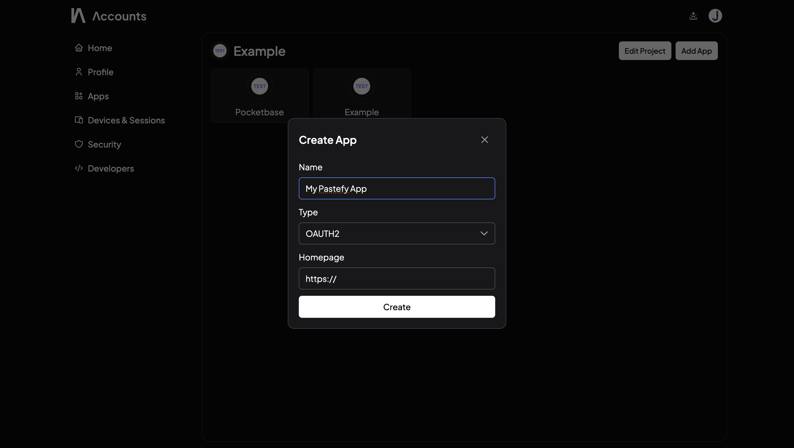
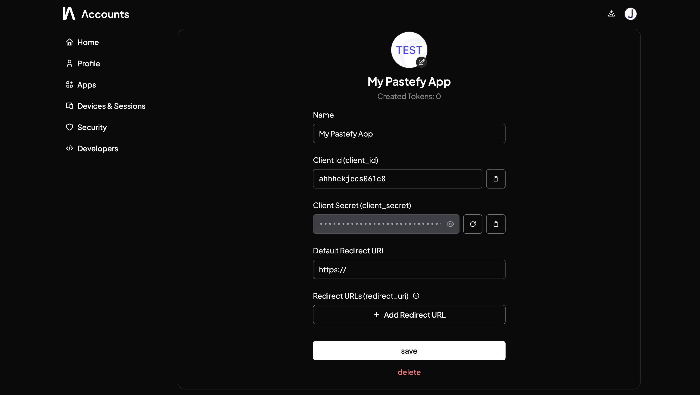

# Integrating Pastefy with OAuth2

::: tip
This tutorial is for the official public Pastefy instance at [pastefy.app](https://pastefy.app). 
If you are selfhosting, this tutorial will not work, as this uses InteraApps' Token Exchange Service.
:::

## Examples with JavaScript/TypeScript Client
(For other languages, see the [InteraApps Token Exchange Documentation](https://intera.dev/docs/accounts/app-access))


### Create an OAuth2 App

1. Go to [accounts.interaapps.de/developers](https://accounts.interaapps.de/developers) and create a new project.
2. Create the OAuth2 App
   
3. Add your redirect URL, e.g. `http://localhost:3000/oauth/callback`, copy the Client ID.
   

### Development
For this example we will use the implicit grant flow, which is the easiest to implement and easiest to show. 
In production you should use the authorization code flow with PKCE.

#### API Client Installation
```bash
npm i @interaapps/accounts @interaapps/pastefy
```

#### Creating the Login Link
```typescript {11-12}
export const oauthClient = new InteraAppsOAuth2Client('CLIENT-ID')

const redirectUri = oauthClient
    .urlBuilder()
    .setRedirectUri(
        window.location.protocol 
            + '//' + window.location.host 
            + '/login-app.html'
    )
    .setResponseType('token')
    // Scope for reading and writing pastes and folders
    .setScopes(['user:read', 'pastefy|pastes', 'pastefy|folders'])
    .build()

window.location.href = redirectUri
```

#### Callback (callback.html)
```typescript {7-8}
const iaToken = 
    (new URLSearchParams(window.location.hash.replace('#', '')))
    .get('access_token')

const client = new AccountsClient(iaToken)

// This is where we exchange the token for a Pastefy API Token
const pastefyApiToken = await client.getKeyFor('pastefy')

const pastefy = new PastefyClient(pastefyApiToken)

console.log('User pastes:', await pastefy.getUserPastes())
```

::: info
When using the code flow do NOT store the Client Secret in the frontend, as it will be public to everyone.
:::